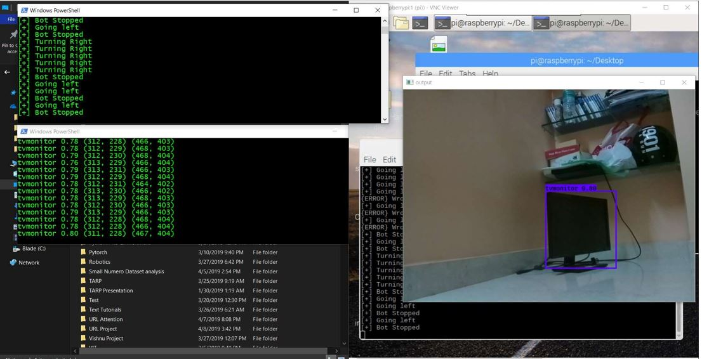
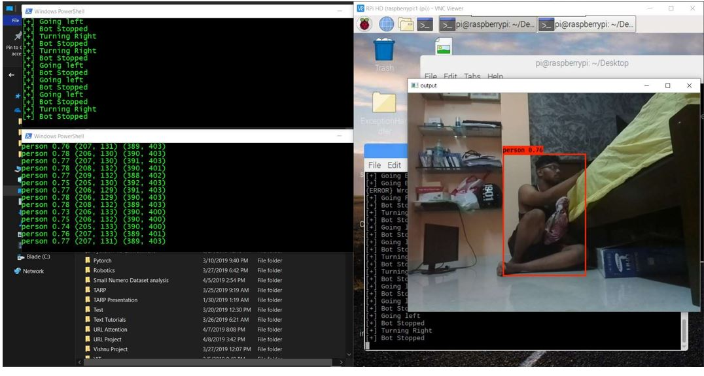
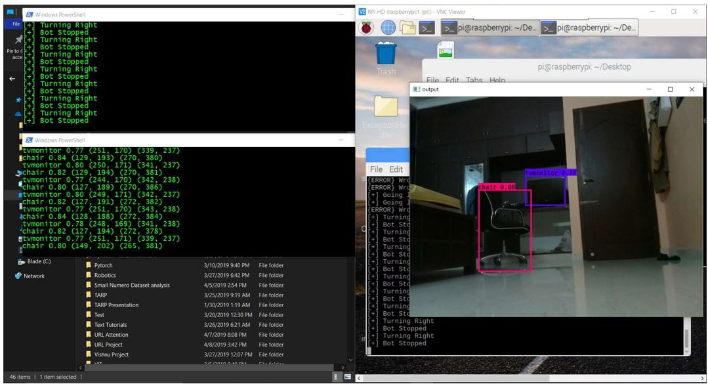

# Disaster Management Robot powered by A.I
## 1. Introduction
This is a complete disaster management robot software or rather an approach or a framework for such development. The project implements a object detection A.I model capable of detecting human beings and this is implemented in Raspberry Pi.
The  Raspberry Pi Bot must have RaspPi Camera to run this code.
Key Features:
 - Robot can be controlled by human being
 - Object detection model has a 56.8 mAP which is reliable
 - This Framework has a client and server where the client is the RPi bot and server is the controller like a laptop which will control the bot with WASD
 - server receives video footage from client and the A.I model runs in server to reduce the load on RPi.
 - Achieved 24 FPS with optimization on Razer Blade 2017 Laptop which has 1060 gtx (6 GB VRAM) as Server and RPi 3 Model B+ as client.
 - Used Tensorflow 1.12. Next Update will use Tensorflow 2.0

## 2. Architecture Explanation
 - The Raspberry Pi Bot with the raspberry pi camera will send a packed image data of each frame via a network to the laptop/controller. This is achieved by spawning a dedicated thread in RPi to handle the packing of images and another thread to send the packed images over the network to the laptop
 - The laptop will have a seperate thread to recieve the packed image data and unpack it and send it to the A.I model for object detection.
 - The output of the A.I model is displayed.
 - The Laptop also spawns another thread to control the robot for moving up and down, left and right etc using WASD keystroke. 'q' keystroke will shutdown the robot and quit the controller in laptop.
 - The keystokes are relayed to the RPi bot via the network and RPi bot parses the keystroke messages and acts accordingly

## 3. Requirement
### 3.1. Software Requirements
 - Python 3.6 or above (Python 2.7.x support in future. Please stop using Python 2.7.x. please Stop it. Get some help)
 - CUDA Toolkit Version 10.0 or greater
 - CuDNN version 7.4
#### 3.1.1 Python Packages Required
 - numpy
 - pandas
 - tensorflow==1.12
 - opencv-python
 - pillow
 - keras
 - scipy
 - sklearn
 - pynput
 - socket
 - threading
 - matplotlib
 - traceback
These are mentioned in requirements.txt
### 3.2. Hardware Requirements
 - Raspberry Pi 3 Model B or greater
 - Raspberry Pi Camera
 - Motors (Not needed for A.I Model alone to run)
 - Motor Driver L293D (Not needed for A.I Model alone to run)
 - Laptop with Nvidia GTX 1060 (6 GB VRAM) or Greater
 - Atleast 8 GB RAM DDR4 (2133 MHz) (Mine is 16 GB 2400 MHz)
 - Any CPU with 4 Cores will be optimal. Have atleast 2.4 GHz Base
 - Power Supply 5V 1A for RPi
## 4. How To Replicate
### 4.1 If u want only the A.I Model
If u want only the video relay method from RPi to Laptop. Then follow this method:  
 - Connect your RPi with the RPi camera. Then download this github project in RPi. Also download this github in a laptop and name the folder as say "Controller" which will recieve your video footage from RPi and runs the A.I Model on it.
 - Now, connect your RPi and your laptop in the same network like a mobile hotspot
 - Open terminal in your laptop or powershell, and setup your python to have a new virtual environment. Then come to the downloaded github folder or "../Controller". Now run
 ```bash
 pip install -r requirements.txt
 ```
 - The above will install all dependency packages for laptop
 - Then go to your RPi, open a terminal there and come to the downloaded github folder and run 
 ```bash
 pip install -r requirements_rpi.txt
 ```
 - The above will install all necessary for RPi
 - Now download the YOLO Model from my mega cloud storage from here [Click here to get the file](https://mega.nz/#!oPhlzS7Z) as yolo.h5 and put it in the ObjectDetection/model_data folder in the laptop
 - Now run the below in your laptop
 ```bash
 python ControllerVideoServer.py <Laptop IP Address> <Port to communicate>
 ```
 - Now, run the below in your RPi
 ```bash
 python RPiVideoClient.py <Laptop IP Address> <Laptop Port that was opened to communicate>
 ```
 - Thats all folks. You are done

### 4.2 If u want the entire package
If u want the entire replication of the Robot. Then you need to follow the website of mine for the tutorial on how to build this. (Coming soon!! under development)

## 5. Outputs
### 5.1 RPi Robot


### 5.2 Robot Output




## 6. Credits
Thanks to all my friends for their support

## 7. References
 - Nvidia CUDA. (2018). Retrieved from [CUDA Docs](http://developer.download.nvidia.com/compute/cuda/9.0/Prod/docs/sidebar/CUDA_Quick_Start_Guide.pdf)
 - Cui, N. (2018). Applying Gradient Descent in Convolutional Neural Networks. Journal Of Physics: Conference Series, 1004, 012027. doi: 10.1088/1742-6596/1004/1/012027
 - Fei-Fei, L., Deng, J., & Li, K. (2010). ImageNet: Constructing a large-scale image database. Journal Of Vision, 9(8), 1037-1037. doi: 10.1167/9.8.1037
 - Han, J., & Kwak, K. (2017). Image Classification Using Convolutional Neural Network and Extreme Learning Machine Classifier Based on ReLU Function. The Journal Of Korean Institute Of Information Technology, 15(2), 15-23. doi: 10.14801/jkiit.2017.15.2.15
 - He, K., Zhang, X., Ren, S., & Sun, J. (2015). Deep Residual Learning for Image Recognition.
 - Hinton, G., LeCun, Y., & Y.ng, A. (1998). ReLU.
 - Lecun, Y., Bottou, L., Bengio, Y., & Haffner, P. (1998). Gradient-based learning applied to document recognition. Proceedings Of The IEEE, 86(11), 2278-2324. doi: 10.1109/5.726791
 - Redmon, J. (2018). YOLO: Real-Time Object Detection. Retrieved from [YOLO Paper](https://pjreddie.com/darknet/yolo/)
  - Szegedy, C., Liu, W., Jia, Y., Sermanet, P., Reed, S., & Anguelov, D. et al. (2018). Going Deeper with Convolutions. 
 - Logistic Regression. (2003). Retrieved from http://ssrn.com/abstract¼360300 or http://dx.doi.org/10.2139/ssrn.360300
 - Logit models from economics and other fields, Cambridge University Press, Cambridge, England, (2003). pp. 149–158) Retrieved from http://ssrn.com/abstract¼360300 or http://dx.doi.org/10.2139/ssrn.360300 ; Logit models from economics and other fields, Cambridge University Press, Cambridge, England, 2003, pp. 149–158
 - Griewank, A. (2014). ON AUTOMATIC DIFFERENTIATION AND ALGORITHMIC LINEARIZATION. Pesquisa Operacional, 34(3), 621-645. doi: 10.1590/0101-7438.2014.034.03.0621
 - Karen Simonyan & Andrew Zisserman.  (2015). VGG-16
 - Russakovsky et al., (2014). ImageNet Large-Scale Visual Recognition Challenge (ILSVRC)
 - Sermant et al., (2013). OverFeat: Integrated Recognition, Localization and Detection using Convolutional Networks
 - Min Lin, Qiang Chen et al., (2014). Network in Network
 - Mathew D. Zeiler and Rob Fergus et al., (2013). Visualizing and Understanding Convolutional Networks Paper
 - Florian Schroff, Dmitry Kalenichenko et al., (2015). FaceNet: A Unified Embedding for Face Recognition and Clustering
 - Cauchy (1847)., Hadamard (1908)., Kelley (1960)., Bryson (1961)., Bryson and Denham (1961)., Pontryagin et al., (1961)., Dreyfus (1962)., Wilkinson (1965)., Amari (1967)., Bryson and Ho (1969)., Director and Rohrer, (1969). Gradient Descent
 - Christian Szegedy, Sergey Ioffe et al., (2016). Inception-v4, Inception-ResNet and the Impact of Residual Connections on Learning
 - Leibniz, (1676)., L'Hopital 
 - DP, Bellman, (1957)., à la Dynamic Programming
